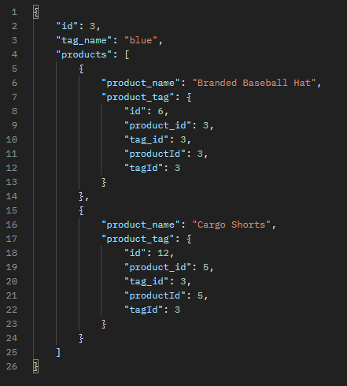
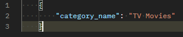
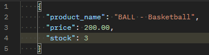

# E-Commerce Backend

## Table of Contents

- [E-Commerce Backend](#e-commerce-backend)
  - [Table of Contents](#table-of-contents)
  - [Licence](#licence)
  - [Description](#description)
  - [Schema](#schema)
  - [Installation](#installation)
  - [Documentation](#documentation)
    - [Endpoints](#endpoints)
    - [Example of GET Responses](#example-of-get-responses)
    - [Examples of POST Requests](#examples-of-post-requests)
    - [Example of PUT Requests](#example-of-put-requests)
  - [Usage](#usage)
  - [Questions](#questions)
  - [Link to GitHub repository](#link-to-github-repository)
  - [Link to Video Recording demonstrating the working application](#link-to-video-recording-demonstrating-the-working-application)

## Licence

MIT License

Copyright (c) 2021 Tudor Andrei Tocan

Permission is hereby granted, free of charge, to any person obtaining a copy
of this software and associated documentation files (the "Software"), to deal
in the Software without restriction, including without limitation the rights
to use, copy, modify, merge, publish, distribute, sublicense, and/or sell
copies of the Software, and to permit persons to whom the Software is
furnished to do so, subject to the following conditions:

The above copyright notice and this permission notice shall be included in all
copies or substantial portions of the Software.

THE SOFTWARE IS PROVIDED "AS IS", WITHOUT WARRANTY OF ANY KIND, EXPRESS OR
IMPLIED, INCLUDING BUT NOT LIMITED TO THE WARRANTIES OF MERCHANTABILITY,
FITNESS FOR A PARTICULAR PURPOSE AND NONINFRINGEMENT. IN NO EVENT SHALL THE
AUTHORS OR COPYRIGHT HOLDERS BE LIABLE FOR ANY CLAIM, DAMAGES OR OTHER
LIABILITY, WHETHER IN AN ACTION OF CONTRACT, TORT OR OTHERWISE, ARISING FROM,
OUT OF OR IN CONNECTION WITH THE SOFTWARE OR THE USE OR OTHER DEALINGS IN THE
SOFTWARE.

## Description

This is an E-commerce api that allows the user to view, add, modify or delete _Products_, the _Categories_ that the _Products_ are part of and the _Products Tags_.

## Schema

## Installation

The installation steps are as follows:

- clone the repository into your local machine;
- open the terminal;
- `cd` into the `e-commerce-backend` folder;

## Documentation

### Endpoints

**CATEGORY**

- **GET** `/api/categories` returns all of the Categories and related data;
- **GET** `/api/categories/:id` return a Category and its related data, targeting it by id;
- **POST** `/api/categories` posts a new Category;
- **PUT** `/api/categories/:id` updates a Category, targeting it by id;
- **DELETE** `/api/categories/:id` deletes a Category and its related data, targeting it by id;

**PRODUCT**

- **GET** `/api/products` returns all of the Products and related data;
- **GET** `/api/products/:id` return a Product and its related data, targeting it by id;
- **POST** `/api/products` posts a new Product;
- **PUT** `/api/products/:id` updates a Product, targeting it by id;
- **DELETE** `/api/products/:id` deletes a Product and its related data, targeting it by id;

**TAGS**

- **GET** `/api/tags` returns all of the Tags and related data;
- **GET** `/api/tags/:id` return a Tag and its related data, targeting it by id;
- **POST** `/api/tags` posts a new Tag;
- **PUT** `/api/tags/:id` updates a Tag, targeting it by id;
- **DELETE** `/api/tags/:id` deletes a Tag and its related data, targeting it by id;

### Example of GET Responses

- GET `/api/categories`
  

- GET `/api/categories/:id`  
  

- GET `/api/products`  
  

- GET `/api/products/:id`  
  

- GET `/api/tags`  
  

- GET `/api/tags/:id`  
  

### Examples of POST Requests

- POST `/api/categories`  
  
- POST `/api/products`  
  
- POST `/api/tags`  
  

### Example of PUT Requests

- **PUT** `/api/categories/:id`  
  
- **PUT** `/api/products/:id`  
  
- **PUT** `/api/tags/:id`  
  

## Usage

- run `npm run seed` command to seed the database;
- run `npm run start` to run the server;
- open the server in your _Insomnia_ or _Postman_ and try the different _GET_, _POST_, _PUT_ and _DELETE_ methods;

## Questions

For any questions regarding this app, please contact me via:

- Email at tudor.tocan@gmail.com
- GitHub at <https://github.com/ttudorandrei>

## Link to GitHub repository

You can view the GitHub Repository by clicking [here](https://github.com/ttudorandrei/e-commerce-backend)

## Link to Video Recording demonstrating the working application

You can view a recording of the working application by clicking [here](#)
